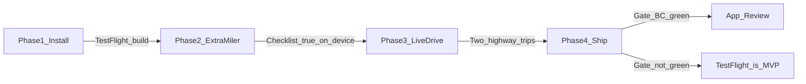

# October MVP

Ship target: a **TestFlight** extra-miler loop by 31 Oct 2026. Road, town, county, record, checklist checkoff, Pathfinder stay-on-highway, trip in Travel Log. Public App Store is optional if review is clean.

This folder is the active queue. The June consolidation board is historical.

## Boards

- [Phase 1 — Installable](./phase-1-install.md) (6–12 Oct)
- [Phase 2 — Extra-miler truth](./phase-2-extra-miler.md) (13–19 Oct)
- [Phase 3 — Live like the user](./phase-3-live-drive.md) (20–26 Oct)
- [Phase 4 — Ship what you drove](./phase-4-ship.md) (27–31 Oct)

## Now

**Phase 1 — in progress.** Store identity, EAS profiles, and Maps/Gemini env wiring are on `cursor/october-mvp-795e`. First TestFlight still needs Expo login, an Apple team, and production env keys on expo.dev. No new GPS chrome until that build exists.

Reliability evidence still lives in [MVP Release Gate](../MVP_RELEASE_GATE.md). Gate is FAIL until navigation-while-moving, background, and offline are proven on device.

## Out of October

Bookings, Tesla 3D renderer, CarPlay, national camera completeness, “new miles” chips, RPG, social, Checklist / Travel Log visual rewrite.
